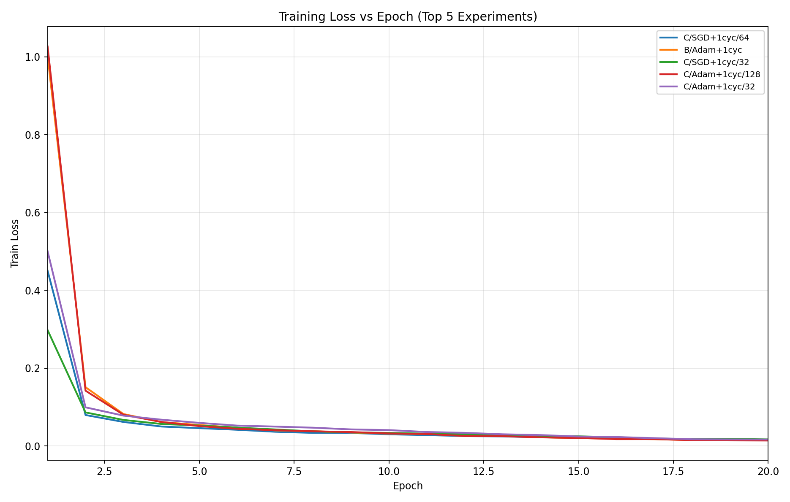
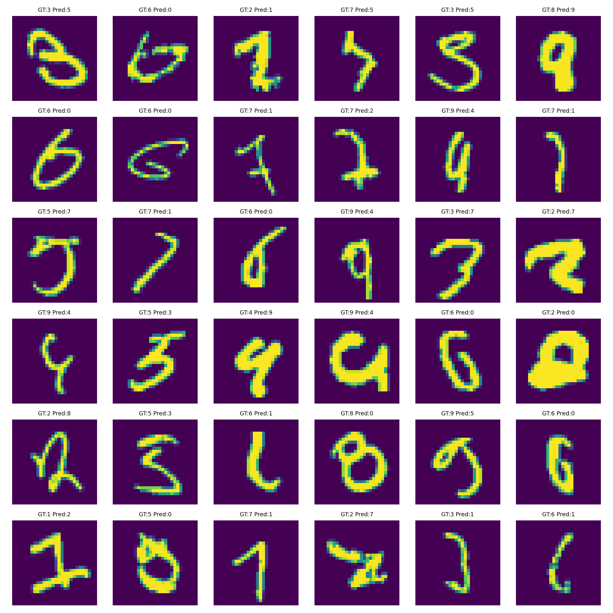
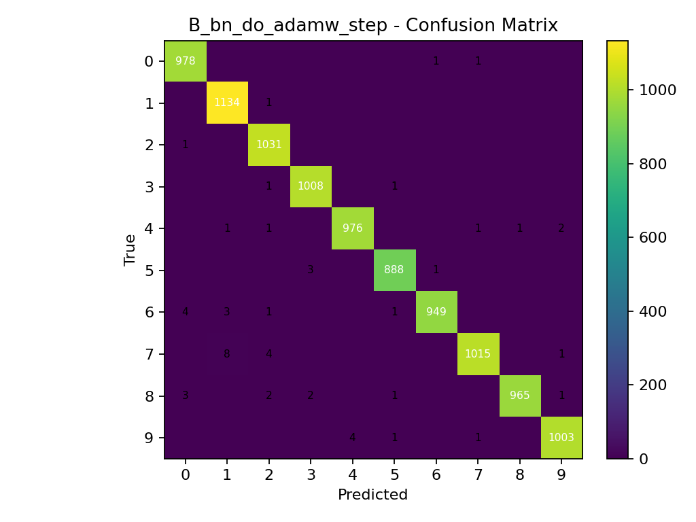

# MNIST Experiments (TinyMNISTNet)

This repo runs a compact set of **reproducible MNIST experiments** with a parameter-budget model.
It compares:
1. **No BN/Dropout** + vanilla gradient descent
2. **With BN/Dropout** + multiple optimizers
3. **With BN/Dropout** + batch-size sweep using the optimizers from (2)
4. **Activation variants** (ReLU, SiLU, GELU) with BN/Dropout

Results are logged to `results/results.csv`. Use `update_readme.py` to generate the README with tables and plots.
Per-experiment epoch CSVs and plots are saved in `results/` and `results/plots/`.

## Folder structure
```text
mnist_experiments/
├─ models/
│  └─ model.py
├─ results/
│  ├─ results.csv
│  └─ plots/
├─ train.py
├─ update_readme.py
├─ requirements.txt
└─ README.md

Quickstart
pip install -r requirements.txt
python train.py --mode grid          # run all experiments
python update_readme.py              # generate README.md with tables + plots

# Single run example
python train.py --mode single --use_bn 1 --dropout_p 0.05 --activation relu   --optimizer adamw --scheduler step --lr 0.0025 --weight_decay 1e-4   --batch_size 128 --epochs 15 --augment 1
python update_readme.py
```

---

## Objective

- **Constraints:** `< 20,000` parameters, `≤ 20` epochs, target `≥ 99.4%` validation accuracy (MNIST 10k test set used as validation; training split is 50k).


---

## Model: TinyMNISTNet

TinyMNISTNet is a deliberately compact CNN designed for MNIST digits.  
It enforces three constraints: **<20k parameters**, **≤20 epochs**, and **≥99.4% accuracy**.

---

### Architecture

```text
Input  : [B, 1, 28, 28]

Conv1  : 1  →  8   (3×3, pad=1)   → [B, 8, 28, 28]
Conv2  : 8  → 12   (3×3, pad=1)   → [B, 12, 28, 28]
Pool   : 2×2                         [B, 12, 14, 14]

Conv3  : 12 → 16  (3×3, pad=1)   → [B, 16, 14, 14]
Conv4  : 16 → 16  (3×3, pad=1)   → [B, 16, 14, 14]
Pool   : 2×2                         [B, 16,  7,  7]

Conv5  : 16 → 24  (3×3, pad=1)   → [B, 24,  7,  7]
Conv6  : 24 → 32  (3×3, pad=1)   → [B, 32,  7,  7]

Conv1×1: 32 → 10   (1×1)          → [B, 10,  7,  7]
GAP    : 7×7 → 1×1                → [B, 10,  1,  1]
Flatten → [B, 10]
Softmax → class probabilities
```

---

### Shape Evolution

- Start: `1×28×28`
- After Conv/Pool blocks: `32×7×7`
- 1×1 Conv: `32→10`, output `10×7×7`
- GAP: average each map → `[10]`
- Softmax: probabilities over 10 digits

---

### Why 1×1 Conv + GAP?

- Flattening features with a dense layer would require ~15k+ parameters.
- Instead: **1×1 conv** needs only hundreds of weights.
- GAP has no parameters, just averages.
- Result: <20k params total, less overfitting, faster convergence.

---

### Parameter Count

| Layer       | In→Out Channels | Kernel | Params |
|-------------|-----------------|--------|--------|
| Conv1       | 1 → 8           | 3×3    | 80 |
| Conv2       | 8 → 12          | 3×3    | 876 |
| Conv3       | 12 → 16         | 3×3    | 1,744 |
| Conv4       | 16 → 16         | 3×3    | 2,320 |
| Conv5       | 16 → 24         | 3×3    | 3,480 |
| Conv6       | 24 → 32  | 3×3    | 6,944 |
| Conv1×1     | 32 → 10  | 1×1    | 330 |
| **Total**   |                 |        | **15,774** |

- **Typical total parameters (most common across runs):** ~15,882


---

## Experiment Design

**What’s varied and why**

- **Learning Rate (LR):** step size for weight updates each iteration.
- **Schedulers:**
  - **OneCycleLR:** Increases LR up to a peak then decreases it within a single run; encourages fast convergence and regularization.
  - **StepLR:** Multiplies LR by a factor (e.g., 0.1) every fixed number of epochs; a simple decay schedule.
  - **ReduceLROnPlateau:** Lowers LR when a monitored metric (e.g., val loss) stops improving; adapts LR to training plateaus.
- **Optimizers (how they update weights):**
  - **SGD (vanilla):** `w ← w − lr * grad` (no momentum here in baseline A). Simple, stable with proper schedules.
  - **SGD + OneCycleLR (B/C):** Same rule but LR follows OneCycle; typically reaches good accuracy quickly.
  - **AdamW + StepLR (B/D):** Adam-style adaptive moments with **decoupled weight decay** (better regularization) + StepLR decay.
  - **RMSprop + ReduceLROnPlateau (B):** Scales updates by running average of squared gradients; LR reduced when progress stalls.
  - **Adam + OneCycleLR (B/C):** Adam’s adaptive moments combined with OneCycle schedule.
- **Activations:**
  - **ReLU:** max(0, x); cheap, strong baseline.
  - **SiLU (Swish):** x * sigmoid(x); smooth, can improve convergence.
  - **GELU:** Gaussian-error linear unit; smooth, often strong in transformers/CNNs.

**Blocks we run**

- **A. Baseline:** no BN/Dropout, **SGD (no momentum)**.
- **B. BN + Dropout + Optimizers:** SGD+OneCycleLR, AdamW+StepLR, RMSprop+ReduceLROnPlateau, Adam+OneCycleLR.
- **C. BN + Dropout + Batch sizes:** {32, 64, 128} across optimizers from (B).
- **D. BN + Dropout + Activations:** {ReLU, SiLU, GELU} using **AdamW + StepLR**.


---

## Best Result (So Far)

- **Experiment:** `C_bs_sweep_sgd_onecycle_bs64`
- **Val Acc:** 99.52%
- **Val Loss:** 0.0151
- **Params:** 15,882
- **Epochs:** 20
- **Best Epoch:** 18
- **Config:** BN: True | Dropout: 0.050 | Activation: relu | Optimizer+Scheduler: sgd + onecycle | LR: 0.05000 | BatchSize: 64 | Epochs: 20


---

## Full Results

_Sorted by **Val Acc (desc)**, then **Params (asc)**, **Val Loss (asc)**, **Train Time (asc)**._

| exp_name | use_bn | dropout_p | activation | optimizer | scheduler | lr | batch_size | epochs | params | val_acc | val_loss | best_epoch | train_time_sec |
| --- | --- | --- | --- | --- | --- | --- | --- | --- | --- | --- | --- | --- | --- |
| C_bs_sweep_sgd_onecycle_bs64 | True | 0.050 | relu | sgd | onecycle | 0.05000 | 64 | 20 | 15882 | 99.52 | 0.0151 | 18 | 229.2 |
| B_bn_do_adam_onecycle | True | 0.050 | relu | adam | onecycle | 0.00300 | 128 | 20 | 15882 | 99.49 | 0.0157 | 18 | 204.4 |
| C_bs_sweep_sgd_onecycle_bs32 | True | 0.050 | relu | sgd | onecycle | 0.05000 | 32 | 20 | 15882 | 99.49 | 0.0169 | 20 | 249.2 |
| C_bs_sweep_adam_onecycle_bs128 | True | 0.050 | relu | adam | onecycle | 0.00300 | 128 | 20 | 15882 | 99.48 | 0.0165 | 17 | 210.3 |
| C_bs_sweep_adam_onecycle_bs32 | True | 0.050 | relu | adam | onecycle | 0.00300 | 32 | 20 | 15882 | 99.47 | 0.0163 | 16 | 250.7 |
| B_bn_do_adamw_step | True | 0.050 | relu | adamw | step | 0.00250 | 128 | 20 | 15882 | 99.47 | 0.0175 | 11 | 206.9 |
| C_bs_sweep_adamw_step_bs64 | True | 0.050 | relu | adamw | step | 0.00250 | 64 | 20 | 15882 | 99.46 | 0.0167 | 19 | 229.1 |
| C_bs_sweep_adamw_step_bs32 | True | 0.050 | relu | adamw | step | 0.00250 | 32 | 20 | 15882 | 99.45 | 0.0186 | 17 | 249.3 |
| B_bn_do_sgd_onecycle | True | 0.050 | relu | sgd | onecycle | 0.05000 | 128 | 20 | 15882 | 99.44 | 0.0176 | 18 | 204.5 |
| C_bs_sweep_rmsprop_plateau_bs128 | True | 0.050 | relu | rmsprop | plateau | 0.00100 | 128 | 20 | 15882 | 99.42 | 0.0198 | 17 | 226.8 |
| C_bs_sweep_sgd_onecycle_bs128 | True | 0.050 | relu | sgd | onecycle | 0.05000 | 128 | 20 | 15882 | 99.40 | 0.0189 | 18 | 203.1 |
| C_bs_sweep_adam_onecycle_bs64 | True | 0.050 | relu | adam | onecycle | 0.00300 | 64 | 20 | 15882 | 99.40 | 0.0193 | 19 | 229.7 |
| D_activation_silu | True | 0.050 | silu | adamw | step | 0.00250 | 128 | 20 | 15882 | 99.36 | 0.0207 | 14 | 364.0 |
| D_activation_relu | True | 0.050 | relu | adamw | step | 0.00250 | 128 | 20 | 15882 | 99.33 | 0.0219 | 16 | 323.3 |
| B_bn_do_rmsprop_plateau | True | 0.050 | relu | rmsprop | plateau | 0.00100 | 128 | 20 | 15882 | 99.32 | 0.0196 | 19 | 218.4 |
| D_activation_gelu | True | 0.050 | gelu | adamw | step | 0.00250 | 128 | 20 | 15882 | 99.30 | 0.0204 | 12 | 419.6 |
| C_bs_sweep_adamw_step_bs128 | True | 0.050 | relu | adamw | step | 0.00250 | 128 | 20 | 15882 | 99.26 | 0.0214 | 16 | 209.9 |
| C_bs_sweep_rmsprop_plateau_bs64 | True | 0.050 | relu | rmsprop | plateau | 0.00100 | 64 | 20 | 15882 | 99.20 | 0.0247 | 13 | 249.6 |
| C_bs_sweep_rmsprop_plateau_bs32 | True | 0.050 | relu | rmsprop | plateau | 0.00100 | 32 | 20 | 15882 | 99.04 | 0.0287 | 17 | 278.3 |
| A_noBN_noDO_vanillaGD | False | 0.000 | relu | vanilla |  | 0.10000 | 128 | 20 | 15774 | 98.81 | 0.0358 | 20 | 207.6 |


---

## Combined Learning Curves (Top 5 Experiments)

**Included runs (Top-5 by Val Acc → Params → Loss → Time):**

| exp_name | val_acc | val_loss | params | epochs | best_epoch |
| --- | --- | --- | --- | --- | --- |
| C_bs_sweep_sgd_onecycle_bs64 | 99.52 | 0.0151 | 15,882 | 20 | 18 |
| B_bn_do_adam_onecycle | 99.49 | 0.0157 | 15,882 | 20 | 18 |
| C_bs_sweep_sgd_onecycle_bs32 | 99.49 | 0.0169 | 15,882 | 20 | 20 |
| C_bs_sweep_adam_onecycle_bs128 | 99.48 | 0.0165 | 15,882 | 20 | 17 |
| C_bs_sweep_adam_onecycle_bs32 | 99.47 | 0.0163 | 15,882 | 20 | 16 |

_Note: Only Top-5 runs are shown below. Full combined plots for **all experiments** are saved in `results/plots/combined_*_all.png`._

**Validation Accuracy (Top 5 Experiments):**


**Validation Loss (Top 5 Experiments):**


**Training Accuracy (Top 5 Experiments):**


**Training Loss (Top 5 Experiments):**




---

## Conclusions

### A. Baseline (no BN/Dropout, vanilla SGD)
- `A_noBN_noDO_vanillaGD` peaked at **98.81%** with 15774 params.
  → Clear gap vs. BN+Dropout variants, confirms normalization/regularization are essential.

### B. BN + Dropout + Optimizers
- Adam OneCycle best: `B_bn_do_adam_onecycle` → **99.49%** (val loss 0.0157).
- AdamW StepLR strong: `B_bn_do_adamw_step` → **99.47%**, faster convergence (best epoch 11).
- SGD OneCycle: `B_bn_do_sgd_onecycle` → **99.44%**.
- RMSprop Plateau weaker, around **99.32%**.

### C. BN + Dropout + Batch-Size Sweep
- Best overall run (within C): `C_bs_sweep_sgd_onecycle_bs64` → **99.52%** (val loss 0.0151).
- Batch size sweet spot at **64**: stable convergence and top accuracy.

### D. BN + Dropout + Activations
- Best activation: **silu** → **99.36%** (under AdamW+StepLR).
- Differences modest on MNIST (<0.1%).

### 🏆 Collective Insights
- BN + Dropout mandatory — baseline A lagged by ~0.6–0.7% absolute accuracy (A best: 98.81%).
- Optimizers: Adam OneCycle and AdamW StepLR were most reliable; RMSprop lagged.
- Batch size: sweet spot at **64**. Too small/large showed minor trade-offs.
- Activations: SiLU/GELU did not significantly outperform ReLU.
- **Best overall:** `C_bs_sweep_sgd_onecycle_bs64` → **99.52%** (val loss **0.0151**) @ epoch **18/20**, **15,882** params. Config: Optimizer=sgd, Scheduler=onecycle, Activation=relu, BatchSize=64.
- **Final takeaway:** With BN + Dropout, thoughtful scheduling (e.g., OneCycleLR/StepLR), and a good batch size, TinyMNISTNet (≈15,882 parameters) reliably reaches **≥99.4% within 20 epochs**; the best run achieved **99.52%**.


---

## Learning Curves & Diagnostics (Per Experiment)


### `C_bs_sweep_sgd_onecycle_bs64`

**Confusion Matrix:**


**Misclassified Samples:**


- Per-epoch CSV: `results/C_bs_sweep_sgd_onecycle_bs64_metrics.csv`


### `B_bn_do_adam_onecycle`

**Confusion Matrix:**


**Misclassified Samples:**


- Per-epoch CSV: `results/B_bn_do_adam_onecycle_metrics.csv`


### `C_bs_sweep_sgd_onecycle_bs32`

**Confusion Matrix:**


**Misclassified Samples:**


- Per-epoch CSV: `results/C_bs_sweep_sgd_onecycle_bs32_metrics.csv`


### `C_bs_sweep_adam_onecycle_bs128`

**Confusion Matrix:**


**Misclassified Samples:**


- Per-epoch CSV: `results/C_bs_sweep_adam_onecycle_bs128_metrics.csv`


### `C_bs_sweep_adam_onecycle_bs32`

**Confusion Matrix:**


**Misclassified Samples:**



- Per-epoch CSV: `results/C_bs_sweep_adam_onecycle_bs32_metrics.csv`


### `B_bn_do_adamw_step`

**Confusion Matrix:**



**Misclassified Samples:**


- Per-epoch CSV: `results/B_bn_do_adamw_step_metrics.csv`


### `C_bs_sweep_adamw_step_bs64`

**Confusion Matrix:**


**Misclassified Samples:**


- Per-epoch CSV: `results/C_bs_sweep_adamw_step_bs64_metrics.csv`


### `C_bs_sweep_adamw_step_bs32`

**Confusion Matrix:**


**Misclassified Samples:**


- Per-epoch CSV: `results/C_bs_sweep_adamw_step_bs32_metrics.csv`


### `B_bn_do_sgd_onecycle`

**Confusion Matrix:**


**Misclassified Samples:**


- Per-epoch CSV: `results/B_bn_do_sgd_onecycle_metrics.csv`


### `C_bs_sweep_rmsprop_plateau_bs128`

**Confusion Matrix:**


**Misclassified Samples:**


- Per-epoch CSV: `results/C_bs_sweep_rmsprop_plateau_bs128_metrics.csv`


### `C_bs_sweep_sgd_onecycle_bs128`

**Confusion Matrix:**


**Misclassified Samples:**


- Per-epoch CSV: `results/C_bs_sweep_sgd_onecycle_bs128_metrics.csv`


### `C_bs_sweep_adam_onecycle_bs64`

**Confusion Matrix:**


**Misclassified Samples:**


- Per-epoch CSV: `results/C_bs_sweep_adam_onecycle_bs64_metrics.csv`


### `D_activation_silu`

**Confusion Matrix:**


**Misclassified Samples:**


- Per-epoch CSV: `results/D_activation_silu_metrics.csv`


### `D_activation_relu`

**Confusion Matrix:**


**Misclassified Samples:**


- Per-epoch CSV: `results/D_activation_relu_metrics.csv`


### `B_bn_do_rmsprop_plateau`

**Confusion Matrix:**


**Misclassified Samples:**


- Per-epoch CSV: `results/B_bn_do_rmsprop_plateau_metrics.csv`


### `D_activation_gelu`

**Confusion Matrix:**


**Misclassified Samples:**


- Per-epoch CSV: `results/D_activation_gelu_metrics.csv`


### `C_bs_sweep_adamw_step_bs128`

**Confusion Matrix:**


**Misclassified Samples:**


- Per-epoch CSV: `results/C_bs_sweep_adamw_step_bs128_metrics.csv`


### `C_bs_sweep_rmsprop_plateau_bs64`

**Confusion Matrix:**


**Misclassified Samples:**


- Per-epoch CSV: `results/C_bs_sweep_rmsprop_plateau_bs64_metrics.csv`


### `C_bs_sweep_rmsprop_plateau_bs32`

**Confusion Matrix:**


**Misclassified Samples:**


- Per-epoch CSV: `results/C_bs_sweep_rmsprop_plateau_bs32_metrics.csv`


### `A_noBN_noDO_vanillaGD`

**Confusion Matrix:**


**Misclassified Samples:**


- Per-epoch CSV: `results/A_noBN_noDO_vanillaGD_metrics.csv`


---

## Reproduce

Use the same commands as in **Quickstart**.

```bash
pip install -r requirements.txt
python train.py --mode grid
python update_readme.py
```
